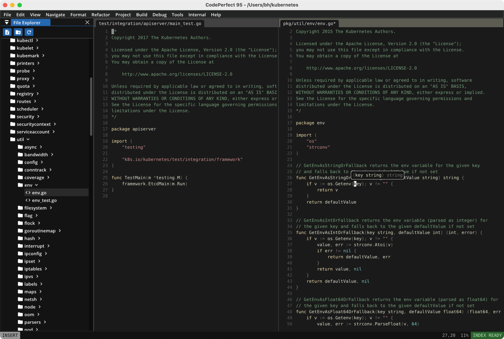
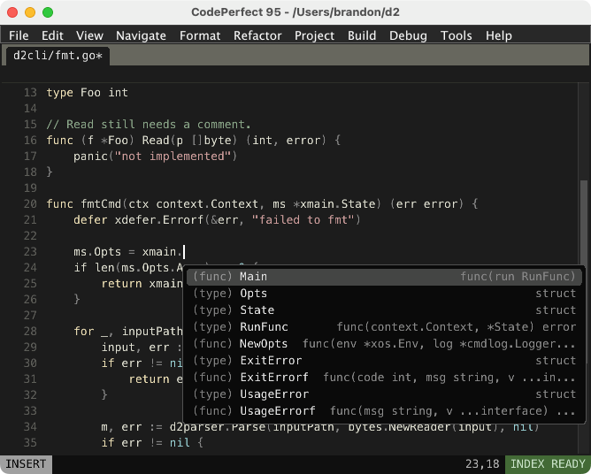
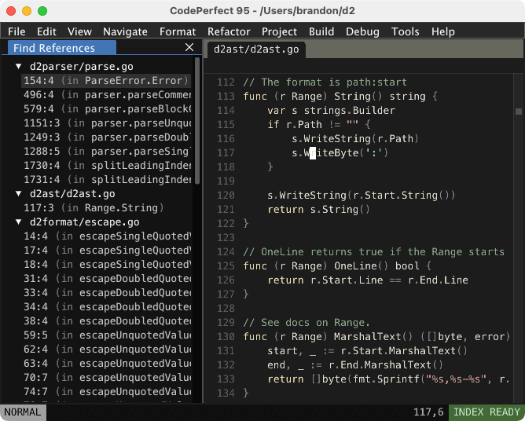
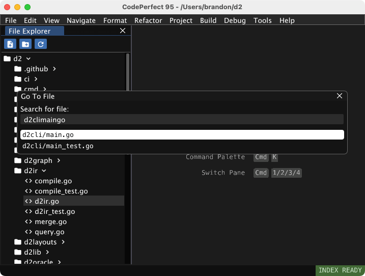
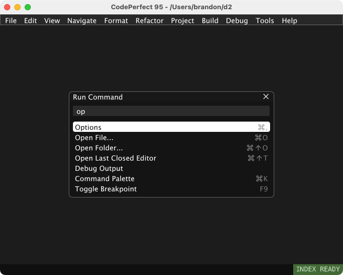
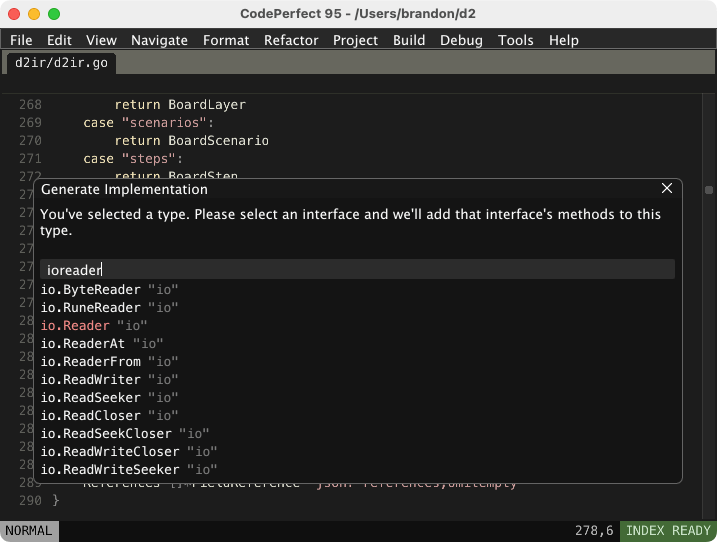

# CodePerfect

<center></center>

CodePerfect was an experiment to build a faster IDE. It eschews the modern tech
stack and is instead written from scratch in C/C++/OpenGL like a video game.

It starts instantly, runs at 144 FPS, has near-zero latency, and comes with
native, full-featured code intelligence and integrated debugging with Delve. See
more of the features [here](https://docs.codeperfect95.com).

It's no longer actively developed, but is now open source and available for
free.

Currently it only supports MacOS and there are no plans to port it to Windows or
Linux.

     

### Links

- [Documentation](https://docs.codeperfect95.com)
- [Changelog](https://docs.codeperfect95.com/changelog)

### Download

- [Build 23.09 — macOS Intel](https://codeperfect95.s3.us-east-2.amazonaws.com/app/mac-x64-23.09.zip)
- [Build 23.09 — macOS M1](https://codeperfect95.s3.us-east-2.amazonaws.com/app/mac-arm-23.09.zip)

### Building

#### Install dependencies

```
sh/install_deps
```

#### Building raw binary

```
sh/build
```

#### Building an .app

```
SKIP_UPLOAD=1 sh/package
```

Without `SKIP_UPLOAD=1` it tries to upload to the S3 bucket, which only I have
access to.
