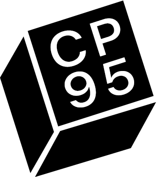

# CodePerfect

CodePerfect was an experiment to build a faster IDE. It eschews the modern tech
stack and is instead written from scratch in C/C++/OpenGL like a video game.

It starts instantly, runs at 144 FPS, has near-zero latency, and comes with
native, full-featured code intelligence and integrated debugging with Delve.
See more of the features [here](https://docs.codeperfect95.com).

It's no longer actively developed, but is now open source and free. It only
supports MacOS and there are currently no plans to port it.

### Links

- [Website](https://codeperfect95.com)
- [Docs](https://docs.codeperfect95.com)
- [Changelog](https://docs.codeperfect95.com/changelog)
- [Download](https://github.com/codeperfect95/codeperfect/releases/)

### Build

#### Install dependencies

```
sh/install_deps
```

#### Build raw binary

```
sh/build
```

#### Build .app

```
sh/package
```

The resulting .app (and .zip) will be in the `scratch` folder.